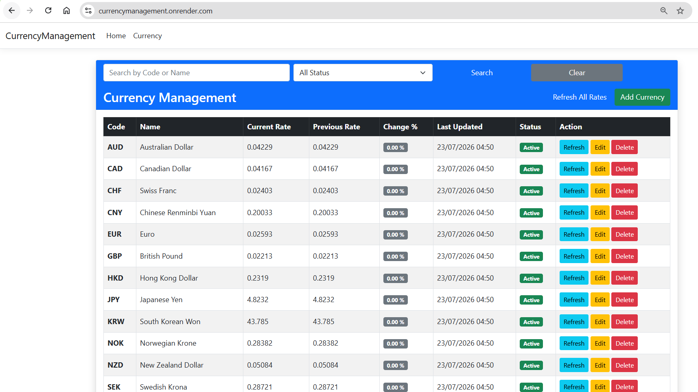

<div align="center">

# 💱 Currency Management System

### ASP.NET Core MVC (.NET 8)

Fund Currency Management & FX Rate Monitoring System


</div>

---

# 🌐 Live Demo

**Render**

https://currencymanagement.onrender.com/

---

# 📂 GitHub Repository

https://github.com/cjutathip/CurrencyManagement

---

# 📑 Table of Contents

- Project Overview
- Screenshots
- Features
- Technologies
- Architecture
- Validation
- Business Rules
- External API
- Project Structure
- Deployment
- Getting Started
- Future Improvements

---

# 📖 Project Overview

This project is a **Currency Management System** developed using **ASP.NET Core MVC (.NET 8)**.

The application allows users to manage currencies used by investment funds and monitor exchange rates through the **Frankfurter API**.

This project was built to demonstrate:

- ASP.NET Core MVC
- CRUD Operations
- Service Layer Architecture
- Dependency Injection
- HttpClientFactory
- External API Integration
- Docker Deployment
- Render Cloud Hosting

---

# 📸 Screenshots

## Currency Management Dashboard

<p align="center">



</p>

---

# ✨ Features

## 📌 Currency Master Data

- View Currency List
- Add Currency
- Edit Currency
- Delete Currency
- Search by Currency Code
- Search by Currency Name
- Filter Active / Inactive
- Server-side Validation
- Client-side Validation

---

## 💹 FX Rate Monitor

- Refresh Single Currency
- Refresh All Rates
- Latest Exchange Rate
- Previous Business Day Rate
- Percentage Change Calculation
- Highlight rows when change exceeds ±1%
- Error Handling
- Async/Await
- Service Layer

---

# 🛠 Technologies

| Technology | Version |
|------------|---------|
| ASP.NET Core MVC | .NET 8 |
| C# | 12 |
| Bootstrap | 5 |
| Docker | Latest |
| Render | Cloud |
| Frankfurter API | Latest |

---

# 🏗 Architecture

```
Controller
      │
      ▼
 Service Layer
      │
      ▼
 HttpClientFactory
      │
      ▼
 Frankfurter API
```

Dependency Injection is used throughout the application.

---

# ✅ Validation

Implemented using Data Annotation and ModelState Validation.

- Required
- StringLength
- Unique Currency Code
- Exactly 3 Characters
- Server-side Validation
- Client-side Validation

---

# 📊 Business Rules

- Compare Latest Rate with Previous Business Day
- Calculate Percentage Change
- Highlight rows when difference exceeds ±1%
- Friendly Error Messages
- Continue processing if API fails

---

# 🌍 External API

Frankfurter Exchange Rate API

https://api.frankfurter.dev/

Endpoints used

```
GET /currencies

GET /latest

GET /{date}

GET /{date}..{date}
```

---

# 📁 Project Structure

```
CurrencyManagement
│
├── Controllers
│     CurrencyController.cs
│
├── Models
│     Currency.cs
│     FrankfurterResponse.cs
│     FxRateResult.cs
│
├── Services
│     CurrencyService.cs
│     IFxRateService.cs
│     FxRateService.cs
│
├── Views
│
├── wwwroot
│
├── docs
│     home.png
│
├── Program.cs
├── Dockerfile
├── appsettings.json
└── README.md
```

---

# 🚀 Deployment

The application is deployed using **Docker** on **Render**.

Live Website

https://currencymanagement.onrender.com/

---

# ▶️ Getting Started

Clone Repository

```bash
git clone https://github.com/cjutathip/CurrencyManagement.git
```

Restore Packages

```bash
dotnet restore
```

Run

```bash
dotnet run
```

Open

```
https://localhost:xxxx
```

---

# 📈 Future Improvements

- SQL Server
- Entity Framework Core
- Authentication & Authorization
- Unit Testing
- Pagination
- Sorting
- Export Excel
- Dashboard
- Historical Rate Chart
- Logging

---

# 👩‍💻 Author

**Juthathip**

ASP.NET Core MVC Developer

GitHub

https://github.com/cjutathip

---

<div align="center">

## ⭐ Assignment Highlights

✔ ASP.NET Core MVC (.NET 8)

✔ CRUD Operations

✔ Dependency Injection

✔ Service Layer

✔ HttpClientFactory

✔ External API Integration

✔ Search & Filter

✔ Validation

✔ Business Rule

✔ Docker

✔ Render Deployment

✔ Responsive UI

</div>